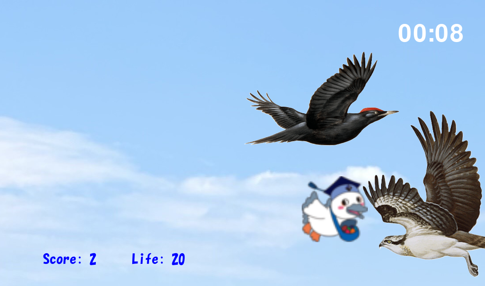

# ドリームバード

## 実行環境の必要条件
* python >= 3.10.9
* pygame >= 2.5.2

## ゲームの概要
* 主人公キャラクターをキーボード操作によりオブジェクトを食べるゲームである
* 参考URL：[ドリームフィッシュ](https://wowgame.jp/game_html/21.html)

## ゲームの遊び方
* 矢印キーで主人公キャラクターを操作し，オブジェクトを食べて主人公キャラクターがでかくなる
* ライフが0になったら，ゲームオーバーとなる
* 主人公キャラクターが時間内にできるだけスコアをとること
* 主人公キャラクターよりも小さいオブジェクトを食べるとスコアアップ＆大きくなる
* 主人公キャラクターよりも大きいオブジェクトを食べるとライフが削れる
* 主人公キャラクターが飛行機に衝突したらゲームオーバー

## ゲームの実装
### 共通基本機能
* 背景画像（空(そら)）と主人公キャラクターの描画
* 矢印キーで主人公キャラクターを操作

### 分担追加機能
* スタート画面（担当：浅川）
* スコア、タイムの描画（担当：宗像）
* ライフの描画、ライフが減ったらゲームオーバー（担当：池田）
* 様々な大きさのオブジェクト（担当：山口）
* 魚とのあたり判定（担当：山口）
* 食ったら主人公キャラクターがでかくなる（担当：加藤）
* 飛行機などで主人公キャラクターにぶつかったら強制ゲームオーバー（文明の利器に勝てない）（担当：池田）

### ToDo
- merge

### メモ
* クラス内の変数は，すべて，「get_変数名」という名前のメソッドを介してアクセスするように設計してある
* すべてのクラスに関係する関数は，クラスの外で定義してある
